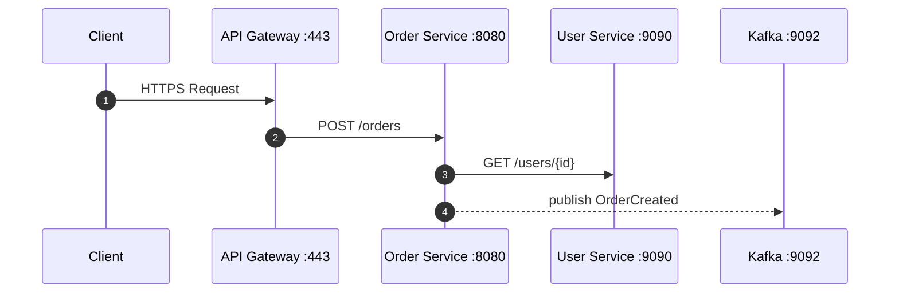

# Order Flow

```mermaid
sequenceDiagram
  autonumber

  participant Client
  participant Gateway as API Gateway :443
  participant Order as Order Service :8080
  participant User as User Service :9090
  participant Kafka as Kafka :9092

  Client->>Gateway: HTTPS Request
  Gateway->>Order: POST /orders
  Order->>User: GET /users/{id}
  Order-->>Kafka: publish OrderCreated
```
